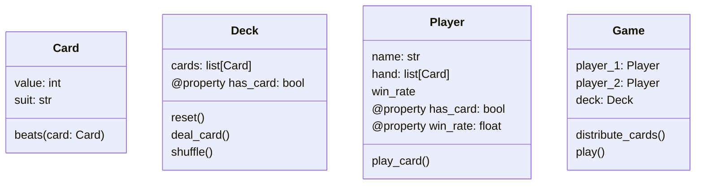

# PyCard
This repository contains an object oriented implementation of a simple card game. The rules are a simplified version of [war](https://en.wikipedia.org/wiki/War_(card_game)): 
- Cards are evenly divided among the players.
- Players play a card from their hands simultaneously, the player with the highest card gets a point
    - Ties are broken with a coin flip
- The game is over when the players run out of cards, which are not recycled.

The program can be run in the console with `python main.py`. This is the _entry point_ of the program. Begin there and investigate the code. Here is the class diagram. The first box contains the class name, the middle box contains the class attributes and properties, and the bottom box contains the class methods.

# Tasks
These tasks are designed to exercise not only how well you can write code, but how well you understand the existing code and how it can be modified. This type of activity is far more common than writing code from scratch, and gives you a starting point that you can emulate as you learn about Python.

## Mini Tasks
Use these tasks as a warm up as you familiarize yourself with the codebase:
- Get player names from the user using the `input` function
- Print the player win rate as a percent, rounded to the 2nd decimal place
    - You could write this as a _helper function_ in the `Player` class
- Rewrite the list comprehension in `win_rate` to use a regular for loop

## Add functionality to the Card Class
The `Card` class currently has `suit` and `value` attributes. Add another attribute called `name`. This attribute should be the text representation of the value according to the following table:

| Value | Text     |
|-------|----------|
| 1     | "Ace"    |  
| 2     | "Two"    |      
| 3     | "Three"  |
| 4     | "Four"   |
| 5     | "Five"   |
| 6     | "Six"    |
| 7     | "Seven"  |
| 8     | "Eight"  |
| 9     | "Nine"   |
| 10    | "Ten"    |
| 11    | "Jack"   |
| 12    | "Queen"  |
| 13    | "King"   |

## Refactor the Player Class
Right now the player's hand is implemented as an attribute which is list of `Card` objects within the `Player` class. Your job is to _refactor_ this code into its own class. 
- Move this and all methods /properties related to this attribute into their own class called `Hand`. 
- Give `Player` an attribute of type `Hand`.
- Give player a method `add_card_to_hand`
- Update the code that deals cards to players to use `add_card_to_hand`

## Modify the Game Class
Currently, only two players are supported in the Game class. Make it so that up to 8 players can play at once.

## Make your own Game

Implement rules for a different game. You may have to completely rewrite the `distribute_cards` and `play` method in the `Game` class. Some possibilties:
- **Guessing Game**: Deal a card from the deck and allow each player to guess the value. The closest player gets the card, and the player with the most cards at the end wins. If players have the same guess, they must try guessing the suit. If they tie or no one guesses the right one, no one gets the card. Otherwise, whoever guesses the suit gets the card.
- [Crazy Eights](https://en.wikipedia.org/wiki/Crazy_Eights) (basically UNO)
- Any kind of poker

